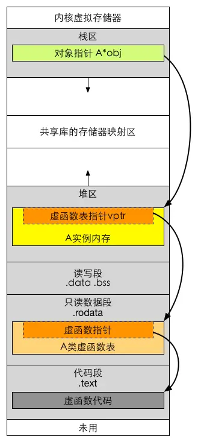

# 15. 面向对象程序设计

## 15.1. OOP: 概述

面向对象程序设计 (object-oriented programming) 的核心思想是数据抽象(封装)、继承和动态绑定(多态).

*   通过数据抽象, 我们可以将接口与实现分离;
    
*   使用继承, 可以定义相似的类型并对其相似关系建模;
    
*   使用动态绑定, 可以在一定程度上忽略相似类型的区别, 而以统一的方式使用它们的对象.
    

## 15.2. 定义派生类和基类

### 15.2.1. 初始化顺序

*   每个类控制它自己的成员初始化过程
    
*   首先初始化基类的部分, 然后按照声明的顺序依次初始化派生类的成员.
    
### 15.2.2. 静态多态 / 动态多态

*   静态多态是通过重载和模板技术实现, 在编译的时候确定.
    
*   动态多态通过虚函数和继承关系来实现, 执行动态绑定, 在运行的时候确定.
    
*   重载: 两个函数名相同, 但是参数的个数或者类型不同.
    
*   重写: 子类继承父类, 父类中函数被声明为虚函数, 子类中重新定义了这个虚函数.

### 15.3. 虚函数

*   虚函数: 基类希望派生类覆盖的函数, 可以将其定义为虚函数, 这样每一个派生类可以各自定义适合自身的版本.
    
*   当基类定义 virtual 函数的时候, 它希望派生类可以自己定义这个函数.
    
*   如果使用 virtual, 程序依据引用或者指针所指向对象的类型来选择方法 (method).
    
*   如果不使用 virtual, 程序依据引用类型或者指针类型选择一个方法 (method).
    
*   虚函数表指针: 在有虚函数的类的对象最开始部分是一个虚函数表的指针, 这个指针指向一个虚函数表.
    
*   虚函数表中放了虚函数的地址, 实际的虚函数在代码段 (.text) 中.
    
*   当子类继承了父类的时候也会继承其虚函数表, 当子类重写父类中虚函数时候, 会将其继承到的虚函数表中的地址替换为重新写的函数地址.
    
*   使用了虚函数, 会增加访问内存开销, 降低效率.

### 15.3.1. 虚析构函数

Q: 析构函数为什么是虚函数?

A: 将可能会被继承的基类的析构函数设置为虚函数, 可以保证当我们 new 一个派生类, 然后使用基类指针指向该派生类对象, 基类指针是可以释放掉派生类的空间, 防止内存泄漏.

Q: 为什么 C++ 默认析构函数不是虚函数?

A: C++ 默认的析构函数不是虚函数是因为虚函数需要额外的虚函数表和虚表指针, 占用额外的内存; 所以只有当一个类会被用作基类时, 才将其设置为虚函数.

## 15.4. 抽象基类

*   纯虚函数是一种特殊的虚函数, 在基类中不能对虚函数给出有意义的实现, 而把它声明为纯虚函数, 它的实现留给该基类的派生类去做. 书写 = 0 就可以将一个虚函数说明为纯虚函数.
    
*   含有 (或者未经覆盖直接继承) 纯虚函数的类是抽象基类(abstract base class).
    
虚函数 VS 纯虚函数

*   类里如果声明了虚函数, 这个函数是实现的, 哪怕是空实现, 它的作用就是为了能让这个函数在它的子类里面可以被覆盖 (override), 这样的话, 编译器就可以使用后期绑定来达到多态了. 纯虚函数只是一个接口, 是个函数的声明而已, 它要留到子类里去实现.
    
*   虚函数在子类里面可以不重写; 但纯虚函数必须在子类实现才可以实例化子类.
    
*   虚函数的类用于 “实作继承”, 继承接口的同时也继承了父类的实现. 纯虚函数关注的是接口的统一性, 实现由子类完成.
    
*   带纯虚函数的类叫抽象类, 这种类不能直接生成对象, 而只有被继承, 并重写其虚函数后, 才能使用. 抽象类被继承后, 子类可以继续是抽象类, 也可以是普通类.
    
## 15.5. 访问控制与继承

*   公有继承保持原始状态 (没有特殊要求一般用公有继承)
    
*   私有继承基类的所有成员都作为派生类的私有成员
    
*   保护继承基类的 public 作为派生类的保护成员, 其他不变.
    