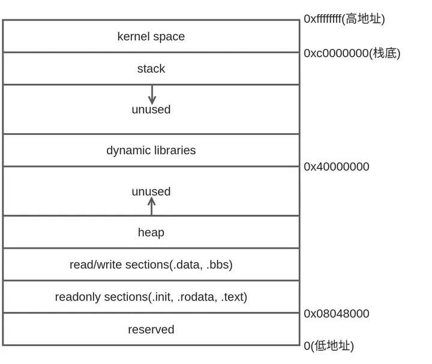

# 20. 链接装载与库

## 20.1. .h 和 .cpp 文件的区别

*   .h 文件里面放申明, .cpp 文件里面放定义.

*   .cpp 文件会被编译成实际的二进制代码, 而. h 文件是在被 include 中之后复制粘贴到 .cpp 文件里.
    
## 20.2. 编译和链接

1.  预编译 (预处理): 预编译过程主要处理那些源代码文件中的以 "#" 开始的预编译指令. 比如 "#include"、"#define" 等. 生成. i 或者. ii 文件.
    
2.  编译: 把预处理完的文件进行一系列的词法分析、语法分析、语义分析及优化后生产相应的汇编代码文件 (.s 文件).

3.  汇编: 将汇编代码转变成机器可以执行的指令 (机器码), 生成. o 文件.

4.  链接: 链接器进行地址和空间分配、符号决议、重定位等步骤, 生成 .out 文件.

## 20.3. 程序的内存布局

一般来讲, 应用程序使用的内存空间里有如下 "默认" 区域.

*   栈: 栈用于维护函数调用的上下文. 由操作系统自动分配释放, 一般包含以下几个方面:
    
*   函数的返回地址和参数
    
*   临时变量: 包括函数的非静态局部变量以及编译器自动生成的其他临时变量
    
*   保存上下文: 包括函数调用前后需要保持不变的寄存器
    
*   堆: 堆是用来容纳应用程序动态分配的内存区域. 由程序员分配释放 , 当程序使用 malloc 或者 new 分配内存时, 得到的内存来自堆里.
    
*   可执行文件映像: 存储着可执行文件在内存里的映像, 由装载器在装载时将可执行文件的内存读取或映射到这里.
    
*   .data: 静态区, 存放全局变量和局部静态变量.
    
*   .bss: 存放未初始化的全局变量和局部静态变量.
    
*   .text: 代码区, 存放 C 语言编译后的机器代码, 不可在运行期间修改.
    
*   保留区: 保留区并不是一个单一的内存区域, 而是对内存中受到保护而禁止访问的内存区域的总称. 如通常 C 语言将无效指针赋值为 0(NULL), 因此 0 地址正常情况下不可能有有效的访问数据.

图 20.1 Linux 进程地址空间布局

### 20.3.1. 段错误

Q: 程序出现 "段错误 (segment fault)" 或者 "非法操作, 该内存地址不能 read/wirte" 的错误信息, 是什么原因?

A: 这是典型的非法指针解引用造成的错误. 当指针指向一个不允许读或写的内存地址, 而程序却试图利用指针来读或写该地址的时候, 就会出现这个错误. 可能的段错误发生的时机如下:

*   指针没有初始化或者初始化为 nullptr, 之后没有给它一个合理的值就开始使用指针.
    
*   使用野指针 (指向一个已删除的对象或者未申请访问受限内存区域的指针).
    
*   指向常量的指针试图修改相关内容.
    

## 20.4. 编译型语言 VS 解释型语言

*   有的编程语言要求必须提前将所有源代码一次性转换成二进制指令, 也就是生成一个可执行程序 (Windows 下的 .exe), 比如 C 语言、C++、Golang、Pascal（Delphi）、汇编等, 这种编程语言称为编译型语言, 使用的转换工具称为编译器.
    
*   有的编程语言可以一边执行一边转换, 需要哪些源代码就转换哪些源代码, 不会生成可执行程序, 比如 Python、JavaScript、PHP、MATLAB 等, 这种编程语言称为解释型语言, 使用的转换工具称为解释器.